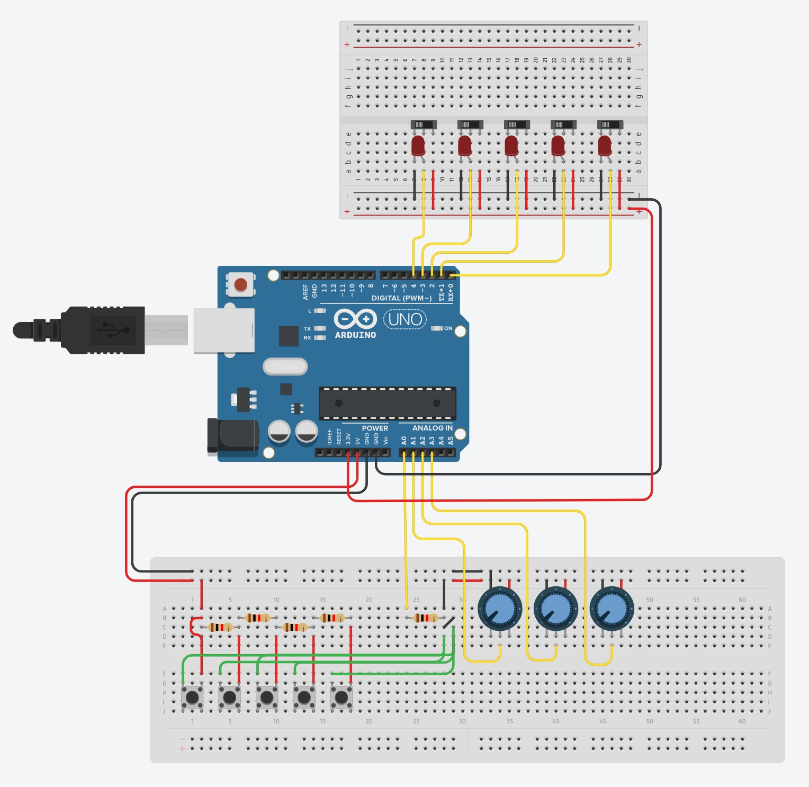

# Buttonbox

## Project Overview

A christmas present for family - button box for flightsim powered by an Arduino.

This repo provides the code base, schematic and a 3D model for a case.

## Hardware Requirements

The 220kΩ resistors are used to step down the resistance of the buttons so they can fit onto a single analog port. If you have sufficient other ports available, you don't need to worry about them.

It is assumed that you have a soldering iron and a breadboard available.

### Shopping List

- [Arduino Leonardo](https://www.arduino.cc/en/Main/Arduino_BoardLeonardo)
  - Note that Arduino Uno does not support the keyboard library
- [220kΩ Resistors](https://www.ebay.co.uk/itm/123368952303)
- [Momentary Buttons](https://www.amazon.co.uk/GTIWUNG-Momentary-Button-Switch-Arduino/dp/B081TZFZVS/ref=sr_1_5?keywords=momentary+buttons&qid=1639948361&sr=8-5)
- [Toggle Switches](https://www.amazon.co.uk/ALLNICE-Position-Toggle-Connection-Arduino/dp/B07KK78RRX/ref=sr_1_3?keywords=toggle+switches&qid=1639948383&sr=8-3)
- [10k Potentiometers](https://www.amazon.co.uk/HALJIA-Potentiometer-Arduino-Raspberry-Projects/dp/B07B2TSDVF/ref=sr_1_8?keywords=potentiometer+10k&qid=1639948417&sr=8-8)

These links are NOT affiliate links and are not neccessarily the same components used in this projects. They serve as general guidance for beginners.

## Code

Upload the sketch to your Arduino through the [Arduino IDE](https://www.arduino.cc/en/software)

## 3D Model

The model provided is by no mean perfect. This is the first model I have created and it's by no means perfect. It would likely also be better to get this lasercut rather than 3D printed like I did. I would also recommend including some mounts to make assembly a bit easier.

A mount for the Arduino on the inside would also be helpful, but my measuring on the components was already off and I bought a cheap Leonardo clone from China so did not trust its dimensions.

## Schematics

Courtesy of [tinkercad.com](https://www.tinkercad.com)

You may use the 5V line for the toggle switches / LEDs. Main reason why the 3.3V line was chosen is as it reaches a comfortable brightness for red LEDs I have.

